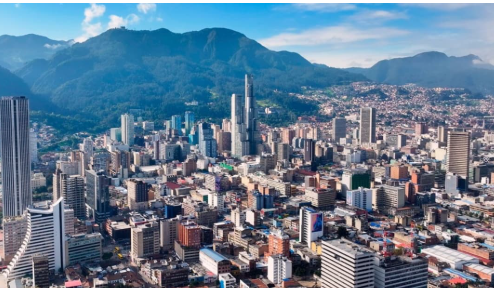

# Bogota D.C., Colombia

## Descripcion
Bogotá, capital de Colombia, es una metrópolis vibrante de más de 10 millones de habitantes ubicada a 2.600 metros en los Andes. 

## Recomendacion

## Foto

## Informaciòn sobre Bogota
Bogotá es la capital y la ciudad más grande de Colombia. Es punto de convergencia de personas de todo el país, así que es diversa y multicultural, y en ella se combinan lo antiguo y lo moderno.

Si quieres viajar a Colombia, seguro te estás preguntando ¿dónde está ubicada Bogotá? Pues bien, la capital del país tiene una ubicación privilegiada, se encuentra en medio de una abundante vegetación que logra uno de los paisajes verdes más hermosos del continente. Está en el centro del territorio colombiano, en el altiplano cundiboyacense y sobre la sabana que lleva su mismo nombre. La ciudad hace parte de la región Andina, una de las seis regiones del país.

Bogotá es verde gracias a sus parques y a los cerros orientales que dominan los santuarios de Monserrate y Guadalupe. Pocas urbes tienen un paisaje como el que los bogotanos disfrutan a diario, cuando su mirada se pierde en esa especie de mar verde que forma la Cordillera de los Andes, en las montañas que se elevan sobre el oriente.

El clima o temperatura que puedes encontrar en Bogotá tiene mucho que ver con la ubicación estratégica de la ciudad. Al tener una altura de 2.600 metros y estar rodeada de montañas, su clima o temperatura durante el día es templado con un promedio es de 19 °C, bajando un poco en las noches. Por esta razón, la ropa de otoño es perfecta para disfrutar del tiempo de Bogotá.

A la hora de visitar la ciudad, podrás maravillarte con el encanto de su arquitectura. En Bogotá encontrarás como se mezclan diferentes estilos, desde edificios modernos, hasta las fachadas de casas antiguas que son auténticos tesoros coloniales.

Gracias a esta fusión entre pasado y presente, en la capital encontrarás un destino ideal con historia, diversión, gastronomía, cultura, negocios y mucho más.