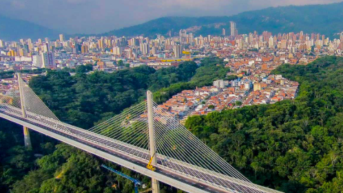

# Bucaramanga, Colombia

## Descripciòn
Bucaramanga, conocida como la "Ciudad Bonita" y "Ciudad de los Parques", es la capital de Santander, Colombia.

## Recomendaciòn
visitar el Cerro del Santísimo 

## Foto
