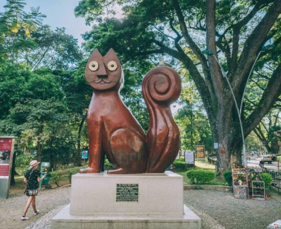

# Cali, Colombia

## Descripciòn
Santiago de Cali, conocida como la "Capital Mundial de la Salsa" y la "Sucursal del Cielo"

## Recomendaciòn
Lugares imperdibles incluyen el barrio San Antonio, el Boulevard del Río, el monumento a Cristo Rey y el Zoológico de Cali.

## Foto

## Informacion sobre Cali
La capital del Valle del Cauca es una ciudad que tiene atractivos turísticos con historia, una vida cultural muy activa y unos ritmos musicales que le han dado fama en todo el mundo.

Los ritmos musicales de Cali, gracias a su riqueza étnica, van desde el currulao de la costa del Pacífico hasta la gran protagonista de la ciudad: la salsa, un ritmo contagiosos y frenético que hace parte de la cultura del país.

Por eso mismo, Cali se distingue en Colombia como la ‘Capital de la Rumba’ y, en el mundo, como la ‘Capital de la Salsa’, porque la fiesta callejera y el baile son característicos.