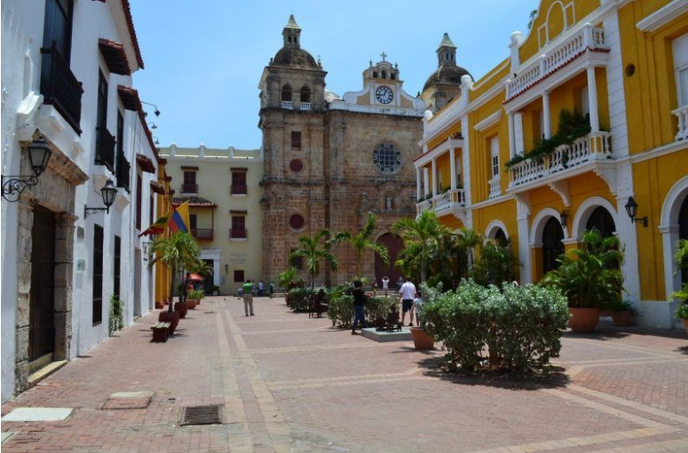

# Cartagena, Colombia

## Descripcion
Cartagena de Indias, conocida como "La Heroica" y Patrimonio de la Humanidad por la UNESCO, es una vibrante ciudad caribeña al norte de Colombia.

## Recomendaciòn
Imprescindible recorrer la Ciudad Amurallada (Patrimonio UNESCO), el Castillo de San Felipe, el barrio bohemio de Getsemaní y hacer una excursión a las Islas del Rosario

## Foto

## Informaciòn sobre Cartagena
Cartagena es una ciudad que está ubicada a orillas del Mar Caribe. Sus calles coloridas llenas de encanto la hacen la puerta de entrada a Suramérica. En Colombia, se encuentra al norte del país, y es la capital de la región de Bolívar. ‘La Heroica’, como la llaman, contempla a su alrededor varios archipiélagos e islas que son paraísos para un verdadero descanso.

Cartagena, suma a sus encantos los atractivos de una intensa vida nocturna, festivales culturales y paisajes exuberantes. Las playas de la ciudad te invitan a hacer turismo, descansar y divertirte con la refrescante brisa y las tibias aguas del mar.

De la misma manera, El tiempo en Cartagena de Indias es muy agradable, pues su clima tropical te permitirá gozar de sus playas y otros encantos. La temperatura en Cartagena durante todo el año es de 27°C en promedio. Un clima ideal para conocer la ciudad amurallada, los restaurantes, entre otros lugares emblemáticos de ‘La Heroica’.

Además, Cartagena cuenta con una excelente oferta gastronómica y una importante infraestructura hotelera y turística.

Este fantástico destino guarda los secretos de la historia en su ciudad amurallada, en sus balcones y en sus angostos caminos de piedra que sirvieron de inspiración a Gabriel García Márquez, ganador del premio Nobel de Literatura en 1982.

Enmarcada por una hermosa bahía, Cartagena de Indias es una de las ciudades más bellas y mejor conservadas de América; un tesoro que, hoy en día, es uno de los destinos turísticos más visitados de Colombia.