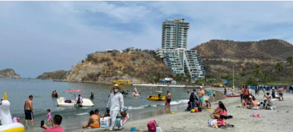

# Santa Marta, Colombia

## Descripcion
Santa Marta, fundada en 1525, es la ciudad más antigua de Colombia y una joya caribeña que combina mar, montaña y riqueza histórica.

## Recomendaciòn
Santa Marta es un destino caribeño ideal que combina naturaleza exuberante y cultura, destacando el Parque Nacional Natural Tayrona (playas cristalinas), la Sierra Nevada (naturaleza y avistamiento de aves), y el Centro Histórico con su Quinta de San Pedro Alejandrino.

## Foto

